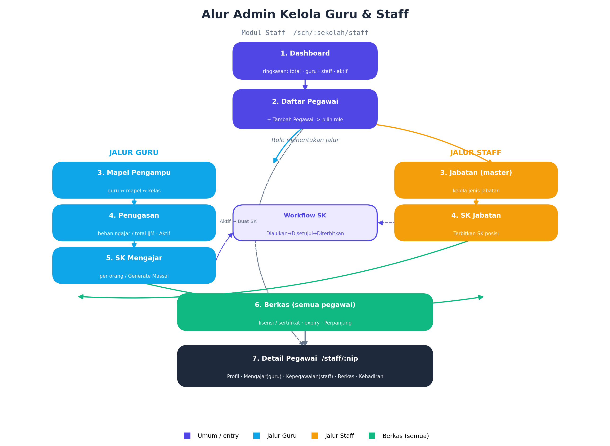

# Staff (Pegawai) — Kelola Guru & Staff

Hub: `/sch/:sekolah/staff`. Satu modul, 8 tab. **Role** (`Pegawai Guru` / `Pegawai Staff`, boleh dual) menentukan jalur kerja admin.

## Alur admin

1. **Dashboard** — ringkasan: total · guru · staff · dual-role · aktif.
2. **Daftar Pegawai** — list + filter (role/status/cari) → **Tambah Pegawai** (`PegawaiFormModal`, pilih ≥1 role + sekolah). Klik baris → detail.
3. **Jalur Guru:** Mapel Pengampu → Penugasan → SK Mengajar.
4. **Jalur Staff:** Jabatan (master) → SK Jabatan.
5. **Berkas** (semua pegawai) — lisensi/sertifikat + tracking expiry.
6. **Detail Pegawai** — tab adaptif sesuai role.

## Routes

| Route | DocType | Aksi admin |
|---|---|---|
| `…/staff` (index) | Pegawai | Dashboard statistik (read) |
| `…/staff/daftar` | Pegawai | Tambah, filter role/status/cari, sort, paginate, row→detail |
| `…/staff/$nip` | Pegawai | Ubah; tab adaptif Profil/Mengajar/Kepegawaian/Berkas/Kehadiran |
| `…/staff/mapel-pengampu` | Mapel Pengampu Guru | Tetapkan `guru ↔ mapel ↔ kelas` |
| `…/staff/penugasan` | Penugasan Guru | Buat penugasan (JJM); per-baris Aktif → "Buat SK" |
| `…/staff/sk-mengajar` | SK Mengajar | Buat; **Generate SK Massal** per tahun_ajaran |
| `…/staff/jabatan` | Jenis Jabatan | Master jenis jabatan (tambah/edit) |
| `…/staff/sk-jabatan` | SK Jabatan | Terbitkan SK posisi |
| `…/staff/berkas` | Berkas Guru | Unggah; per-baris **Perpanjang** masa berlaku |

## Sistem role

`Pegawai.roles[]` → `[{ role: "Pegawai Guru" }, { role: "Pegawai Staff" }]`. Dual-role didukung. Helper di `features/pegawai/roles.ts`:
- `apiIsGuru` / `apiIsStaff` / `apiIsDualRole` — klasifikasi.
- `apiRoleBadges` — render badge (`RoleBadges.tsx`).

UI adaptif: Mapel Pengampu & Penugasan hanya relevan untuk guru; SK Jabatan & tab Kepegawaian hanya saat staff.

## Rantai SK

- **SK Mengajar:** Penugasan Guru (status Aktif) → tombol "Buat SK" (1:1) **atau** `BulkGenerateSkButton` (massal per tahun_ajaran) → SK Mengajar draft.
- **SK Jabatan:** dari Jenis Jabatan → "Terbitkan SK".
- Workflow status (keduanya): **Diajukan → Disetujui Kepsek → Diterbitkan** (atau **Dicabut**).

## Berkas (compliance)

`Berkas Guru` dengan `tanggal_kadaluarsa` → status auto Aktif/Expired. `RenewBerkasButton` extend masa berlaku.

## Komponen kunci

| File | Peran |
|---|---|
| `features/pegawai/roles.ts` | Logika klasifikasi role |
| `features/pegawai/PegawaiFormModal.tsx` | Form tambah/ubah pegawai |
| `features/pegawai/RoleBadges.tsx` | Badge role |
| `features/pegawai/PegawaiActions.tsx` | `BuatSkMengajarButton`, `RenewBerkasButton`, `BulkGenerateSkButton` |

> Regen diagram: `python docs/staff-flow.py` (matplotlib) → `staff-flow.png`.
